# 主要的四种卷积神经网络的学习

## 一、Alexnet

**亮点**
	**1.ReLU Nonlinearity**
		不同于Sigmoid和Tanh这两种“饱和激活函数”，ReLU是“非饱和激活函数”，可以很好的解决 Vanishing Gradient 的问题 （神经网络最后几层参数的gradient变化较快，导致前几层未有太大改变时最后几层就已经收敛了，停止更新gradient），同时ReLU在某种层面上相当于 linear的函数，可以加快收敛速度。

​			Local Response Normalization	
​					论文中提到并不需要通过输入归一化来防止饱和，==但局部响应归一化有助于泛化（？？）==，公式如下图，当然在pytorch中已经归一化了，所以不用麻烦

 ReLU的缺点以及后续的新的改进函数：
	当一个很大的梯度流经过ReLU神经元并更新完参数之后，这个神经元梯度会容易置为0，不会对任何数据有激活现象了，相当于这个神经元已经没有作用了。
	

Leaky ReLU
RReLU
.png)

​		

​	2.GPU运行
​		这个现在已经常用了，pytorch很容易实现

​	**3.Overlapping Pooling**
​		覆盖的池化操作，也就是池化层的步长与池化层的size不一致，导致池化的时候有重合的部分，论文中认为这样会让model更不容易过拟合。

​	**4.防止过拟合的方法**
​		除了上面提到的Overlapping Pooling，论文中提到了两种方法

​			i.**数据增强**
​					同样论文中提到两种方式
​						第一种简单来说就是对原始数据进行一个水平翻转或者图像变换来扩大原始数据集
​						第二种就是改变训练图像的RGB通道的强度，具体就是对RGN像素值集合执行PCA（提取主成分，另外的方法还有auto-encoder),将主成分乘以一个随机变量再加回原图像，简单来说就是改变了图像的光照颜色和强度。

​			ii.**Dropout**
​					按设置的几率随机丢弃一些神经网络，至于Dropout为何有用，有很多观点，就不一一列举了，就写一个我觉得挺有趣的观点：Dropout相当于性别在生物进化的作用，即使无性繁殖可以有效地保留祖先的基因，但其对环境的抗干扰性较差，而Dropout就是提高了神经网络的抗环境干扰能力，使其可以在物竞天择的环境下生存下来。		

​		

## 二、VGG-net

​	VGG可以说是在Alexnet上的一个延申，相当于对其的改进与深化(将深度推到16-19层），其性能仅次于Googlenet，但由于其简单与方便而被广泛使用（在resnet出现之前），但  有人认为 VGG的网络其实就是 各个层数 卷积核 池化层的一些组合，是通过实验得出的基于Alexnet的最优的网络，至于 一些对于VGG每一层的意义的分析我觉得还是有点扯淡的，完全就是由结果推原因。

​	对于VGG的一些具体的参数这里就不详细列举了，torchvision上有已经训练过的vgg网络model，输入是3 * 224 * 224

​	**一些概念：**
​			1.感受野（Receptive Field）：
​					定义：卷积神经网络每一层输出的特征图上的像素点在输入图片上的映射区域大小，简单来说就是输出图上的点对应输入图上的区域，所以最后一层的感受野就是卷积核的大小，然后响应向前传。

**亮点**
	1.卷积核的大小不同于之前的11 * 11或者7 * 7，而是3 * 3的且步长为1 ，这样可以扩展网络深度（因为3个3 * 3的卷积核的感受野才相当于1个 7 * 7的，论文中提出1个3 * 3的感受野和1 个 5 * 5的一样 ）
		与此同时，3 * 3的卷积核对应的参数更少，（3个3 * 3的 比 1个 7 * 7 的少）, ==这样就？？论文中好像没有说有什么好处== 应该是更容易趋于收敛？

​		另外提一下卷积核大小对网络的影响，卷积核相当于提取图片的局部信息，那么如果卷积核越大，它所提取到的局部信息也就越大，但是如果图片上的有用信息只占了一小块，比如说我只想知道图片中的人的头部，那用大卷积核就会浪费，增加了参数却没有什么改进的效果。

​			**至于为什么要增加网络深度:**
​					每一个卷积层之后都引入了一个非线性修正层（ReLU），这样会使网络的非线性性增加，表达能力也就更强，决策函数也就更具有辨别能力。

​	**1 * 1 的卷积核**
​			这个算是VGG乃至后续神经网络的一个挺重要的特点，1 * 1的卷积核的输入和输出是完全一致的，但其却非常有用
​			首先增加了网络的深度，同时并没有增加感受野，增强网络的深度的好处上面已经提到了，而感受野的增加会导致特征越来越抽象
​			其次可以升维或者降维，这个很好理解，简单来说就是卷积核的数目的变化导致了特征图维度的改变，其中降维可以很好的减少参数，防止参数过大增加对机器的负荷。

​	**2.池化层的size 2 * 2  （原来是3 * 3 步长为2 的 重叠池化层）** 
​			带来更细节的信息捕捉，而且一般都是max-pooling ，可以带来更大的局部信息差异性，更好的描述边缘、纹理等构成语义的细节信息。  （从可视化的特征图上看出来的。。。）

​	3.Alexnet采用的训练优化算法是SGD，而VGG采用带有momentum的mini-batch的梯度下降法（也就是带有momentum的SGD）momentum的作用主要就是用来解决SGD的噪声问题，简单来说就是当前后梯度一致的时候，可以加速学习，前后梯度不一致的时候，能够抑制震荡，可以用动量来理解，当物体带有较大动量的时候，对其状态的改变会困难一点

​	**4.网络权重初始化**
​			这个论文中有提到说是 采用随机初始化来避免预训练
​			至于初始化的作用也是不言而喻的，一个不好的初始化会由于深度网络中的梯度不稳定而使学习终止，或者达到的最优值其实并不是理想最优值（自行理解），当然在torchvision中已经有训练过的VGG了，上面的参数的初始值已经很不错了，所以并不需要太担心。	

​	**==5.全连接层==**
​			这个也是很重要的东西，当然这不是VGG的亮点了，因为VGG中的全连接层在Alexnet中已经使用了，但现在已经并不提倡全连接层了，这里就分析一下全连接层的作用。至于卷积层的作用就不多说了，简单来说就是聚焦图片的局部特征。

​			对全连接层可以有个通俗的理解：卷积网络把图片的局部特征拆解出来，再由全连接层把这些特征组合起来，形成机器认为的东西，以此达到最终的分类器的一个目的。（最后全连接层输出的结果，一般要用softmax函数进行分类，得到的也不是一个值，而是多维值，只不过有个值比其他的大，而这个值对应的物体就是机器认为的物体）

> ​			正因为如此，全连接层会忽略图片的空间特性（也就是图片上的某样东西在图片上的位置），所以无法用来做在图片上找东西的任务，比如图像分割（此处参考https://blog.csdn.net/weixin_41055137/article/details/81174443）
>

​			至于卷积层的层数，宽度到底怎样才是最好的呢？不知道。简单来说就是越多拟合能力越强，也就越容易造成过拟合。

​			但有个奇怪的点就是VGG论文中测试的时候把全连接层替换成了卷积层，使得原图像不用resize就可以被处理，也被认为有一定好处，但是torchvision采用的却还是包含全连接层的版本。

​	最后至于VGG层的这种卷积池化的分布是为什么，我认为应该是实验累积所致。同时网上有很多感性的分析就不写了，毕竟VGG相对于resnet而言还是过时了一点。

## 三、Googlenet

​		Googlenet 提出了一种新的结构叫做Inception，也是一个重要的里程碑，后续Inception不断进化出现了多个版本。

	### Inception v1

**亮点**

​		**1.Inception结构**
​				不同于之前的Alexnet和VGG网络对卷积层的串联叠加（因为这样不仅会导致参数爆炸无法训练，同时很可能造成过拟合），Googlenet由许多Inception串联而成，而Inception中的各种层（卷积层，maxpooling层）为并联结构。为了使网络层次更深更宽，Googlenet认为应该引入稀疏性并将全连接层替换成稀疏的全连接层，甚至是卷积层。至于提出的动机，论文中提到最开始其实是作为案例研究，用于评估一个复杂网络拓扑构建算法的假设输出（并没有读懂）。

​				Inception中的卷积核尺寸大多为1 * 1、3 * 3、 5 * 5，论文中提到是为了避免块矫正问题（patch-alignment issues）（即方便所有卷积后的输出的尺寸设为一致，可以并联到一起），具体结构如下图

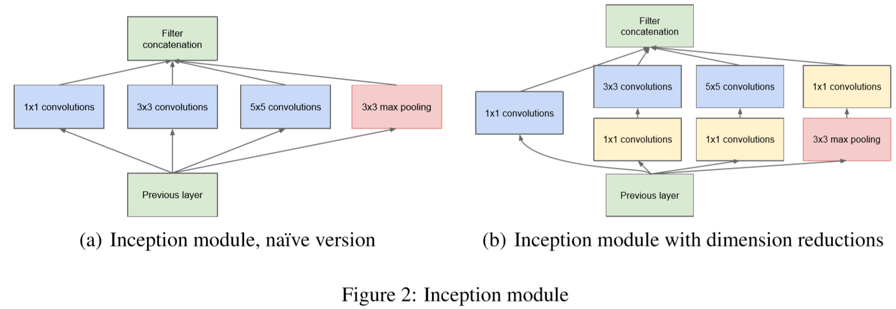

​				右侧的结构主要是考虑到5 * 5的卷积核引入的参数太多，无法好的延申网络深度，于是在进行卷积前用1 * 1的卷积核进行降维操作（1 * 1卷积核的作用在VGG中已经提到过了）

​				在googlenet模型的前几层可以看到仍然是传统的卷积串联方式，而到了后面由于高层次提取高抽象性的特征，空间集中性会降低，因此3x3和5x5的卷积核在更高层会比较多。

​				下图googlenet的模型图

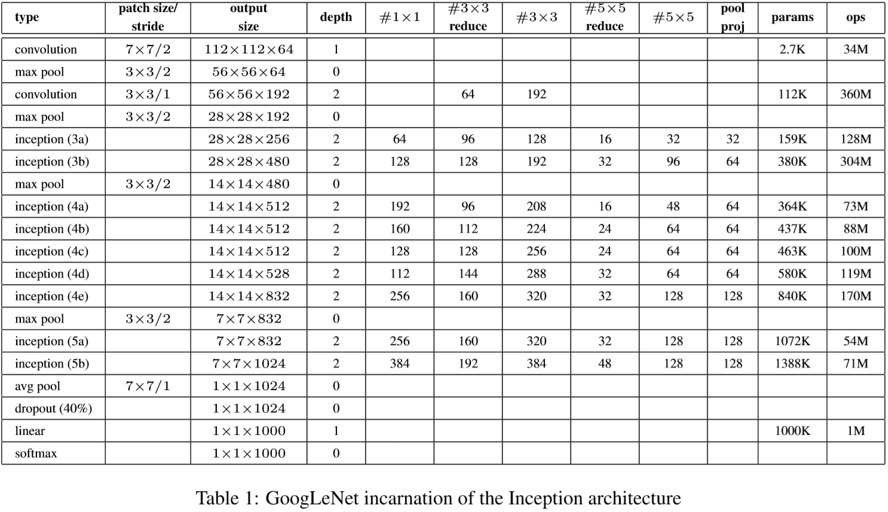

​				还有一个值得注意的地方就是googlenet的最后几层并不是fully connected层，而是avg pool层，这是因为论文中说改成这样之后提高了top1的准确率（虽然只提高了0.6%）		

​	**2.辅助分类器**

​			Google中应用了辅助分类器，主要作用是提供正则化的同时克服梯度消失（vanishing gradient）的问题。
不过辅助分类器只在训练中使用了，在测试中并没有使用。

​			辅助分类器简单来说就是计算在网络中间的输出的loss，再结合权重加到最终的loss上。

### Inception v2

​		在改进的Inception v2中添加了Batch Normalization，同时将5 * 5的卷积分解为两个 3 * 3的卷积运算以减少参数提高计算速度。

​		**Batch Normalization**

​				这个主要解决的问题就是“Internal Covariate Shift”，因为网络层次越深，前面层的参数更新导致的输出变化会使后面层的输入变化非常剧烈（简单来说就是前面微小的变化都会导致后面剧烈变化的蝴蝶效应），所以在训练参数更新时，后面层的输入分布就会shift了，移到不知道哪里去了，这样会导致学习速度降低，或学习过早的停止，并且需要人们谨慎的调节参数。

​				**好处**
​					加快训练速率，提高网络泛化能力，简单来说就是不用那么刻意的去调节学习速率，前面Alexnet网络中有提到LRN（局部响应归一化），在运用了BN层之后就不需要这个了，因为BN本身就是一个归一化网络。

​					至于归一化处理（把样本特征值映射到$[0，1]$区间）的好处：使训练数据分布与测试数据分布相同，提高网络的泛化能力。

​				Batch Normalization的操作计算公式如下（正向与反向传播）

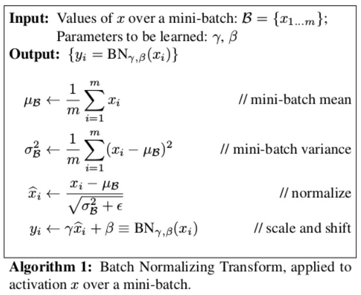

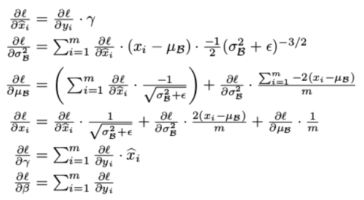

		### Inception v3

​			**factorized convolution（分解卷积）**

​				这个就更神奇了，卷积核不再是n * n的了而是变成n * 1的了$（n * n -> 1 * n + n * 1）$，不过论文中提到在前几层网络这样的效果并不好，在中间用效果才明显一点。（每一个卷积层都是配备激励函数的）

​				因此inception层就变成了下图（第一个为之前正常的inception层，后两个为改进）

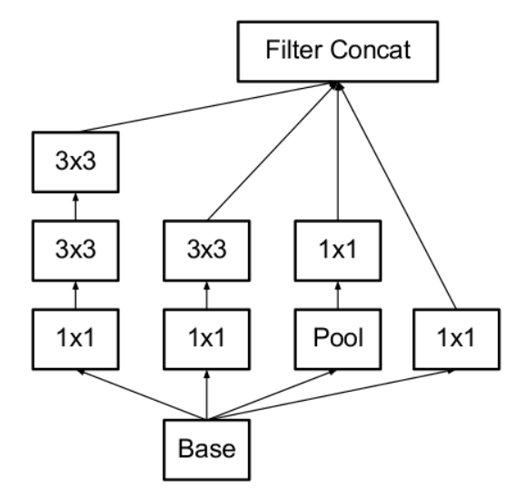

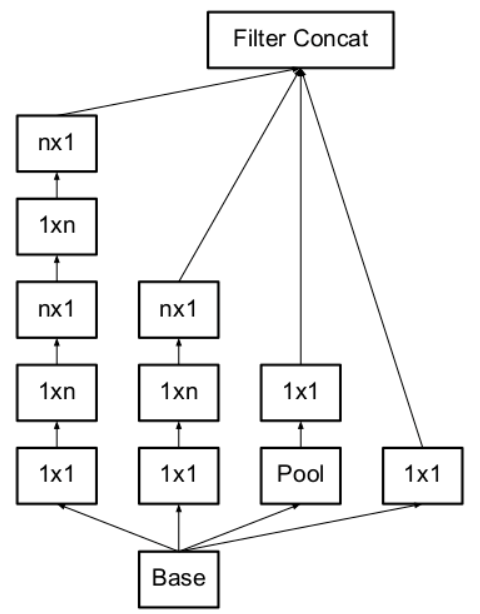

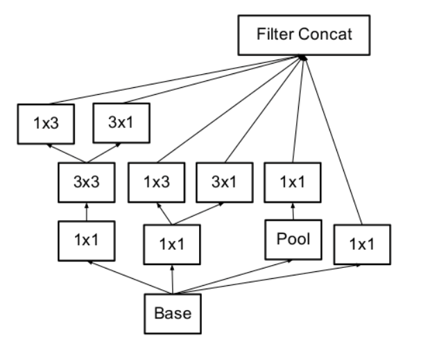

​			**aggressive regularization**

​					没读懂

### 	Inception v4

​				在Inception v4中一共提出了三种神经网络，分别是Inception v4，inception-Resnet-v1，inception-Resnet-v2，其实都是大同小异，其中后两种结合了inception和Resnet，效果肯定比之前所有都要好多了，这里就不细讲了。

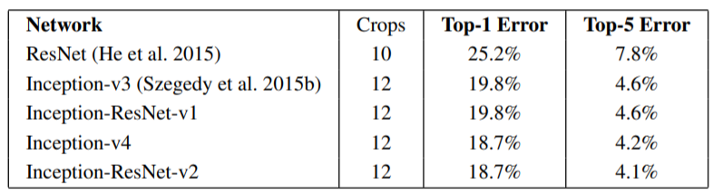

## 四、Resnet

​			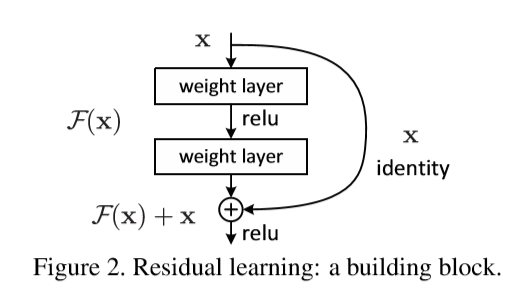

​		上图是resnet的一个残差块，与普通的连接层相比，多了一个identity mapping，来实现shortcut connection，简单来说就是把输入$x$跳跃一下直接到激励层前，那么在经过最后一个激励层的输入就是
$F（x）+ x$   其中$F（x）$就是正常串联层的输出，$x$就是跳跃过来的输出。

​		这样可以很好的解决网络深度太深所导致的一系列问题（例如过拟合），因为$F(x)$是可以标记为0的，这样就相当于没有了这一层，那么也就不会出现过拟合。

​		值得注意的一件事就是，如果$F(x) $和$ x$ 的维度不一样怎么办呢？这里就涉及到了两种不同的shortcut connection方式，以下图为例

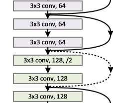

​				主要的区别就是上图中那个的实线与虚线的区别。
​				实线中，输入是由3 * 3 * 64的卷积核卷积而成（卷积核大小为3 * 3，共64个卷积核），经过两层卷积层之后，依然是64个卷积核的卷积，channel依然是64，所以并不需要做什么改变，经shortcut connection的x与$F(x)$可以直接相加，也就是上文提到的$F(x)+x$
​				虚线中，经之前的卷积后，channel为64（即$x$的维度为64），在经过两层卷积之后，channel变为128（即$F(x)$的维度为128），这样二者就无法相加，需要调整x的维度，即变成$F(x)+Wx$,这里的W是对x进行卷积 操作，具体可以看看代码
​				这里只讲了卷积核数量上的维度，图片的维度不同也是会有影响的（如果不加stride和padding，经过卷积之后图片大小会变化，这样也会无法相加，这时候就需要对x进行卷积操作使维度一致）

​			

​				

​				下图是论文中提到的具体的残差块，分别被称为BasicBlock和Bottleneck Block，其中BasicBlock一般应用在浅层的网络中，Bottleneck Block应用在深层的网络中，可以看到Bottlenck Block先用了1 * 1的卷积层降维，再用1 * 1的卷积层升维，这样的好处之前也在Inception中提到过，可以减少参数，增加网络的泛性，使网络可以达到的层次更深。

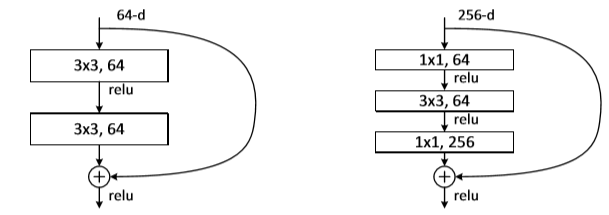